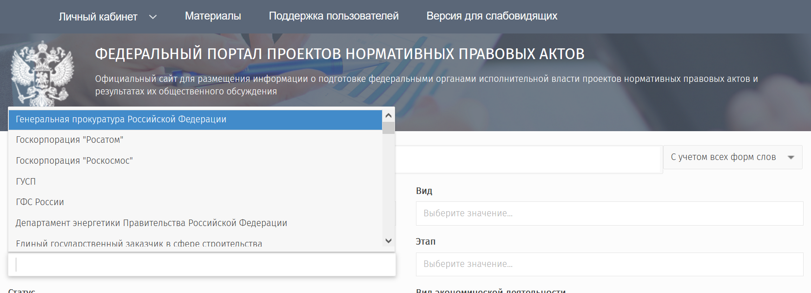
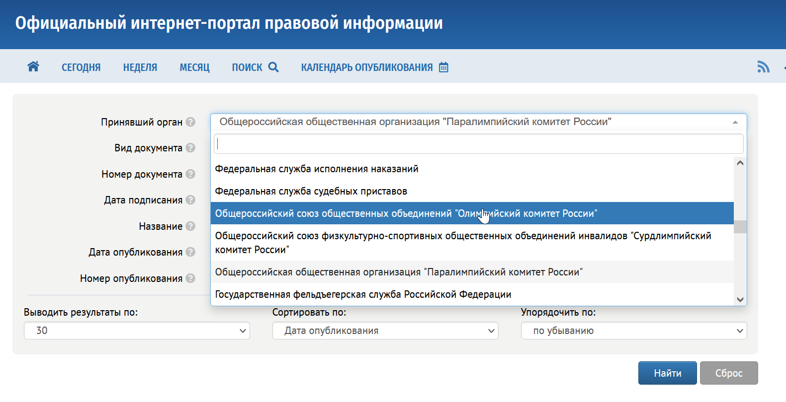

# По полномочиям и нормативно-правовому статусу

Государственные некоммерческие организации, помимо прямой связи с органами власти также вовлечены в исполнение тех или иных функций в рамках государственного управления или в рамках поручения(-й) получаемых от органов власти.

В ряде случаев их роль закреплена на уровне нормативно-правовых актов, в других случаях они определены на уровне официальных документов (поручений, решений комиссий) без статуса-нормативно правового акта и, также, могут быть просто получателями финансирования из государственных бюджетов не имея нормативно закреплённой роли.

Организации можно разделить на четыре условные группы։
- имеющие полномочия органов власти
- имеющие функции, закреплённые нормативно-правовыми актами
- действующие в соответствии официальными документами не имеющих статуса НПА
- не имеющие нормативно-правового и иного закрепления

## Организации имеющие полномочия органов власти

Ограниченное число некоммерческих организаций в форме государственных корпораций имеют полномочий органов власти, в том числе, например, в области лицензирования. Количество таких организаций невелико и сводится к государственным корпорациям.

```admonish note 
в соответствии с пунктом 2 статьи 14 Федерального закона от 13 июля 2015 г. № 215-ФЗ части 55 статьи 12 Федерального закона от 4 мая 2011 г. № 99-ФЗ «О лицензировании отдельных видов деятельности» Государственная корпорация по космической деятельности «Роскосмос» предоставляет государственную услугу [«Лицензирование космической деятельности»](https://www.roscosmos.ru/22364/).

Кроме того государственные корпорации Роскосмос и Росатом являются разработчиками нормативно-правовых актов и, в том числе, обязаны проводить публичное обсуждение их НПА на [Федеральном портале нормативно-правовых актов](https://regulation.gov.ru).


```

Можно было бы выделить госкорпорации как отдельный подвид организаций, но, например, госкорпорация Ростех не имеет нормативно правовых полномочий, зато такие полномочия есть у 3-х организаций связанных с олимпийским комитетом. 

Это организации публикующие совместные приказы с Минспорта России:
- Общероссийский союз общественных объединений "Олимпийский комитет России"
- Общероссийский союз физкультурно-спортивных общественных объединений инвалидов "Сурдлимпийский комитет России"
- Общероссийская общественная организация "Паралимпийский комитет России"


```admonish note
Список некоммерческих организаций на Официальном интернет-портале правовой информации
Официальный интернет-портал правовой информации.



По каждой из организаций есть несколько приказов подготовленных с Минспорта России.
```


## Организации имеющие функции, закреплённые нормативно-правовыми актами

Значительная часть некоммерческих организаций создаются в соответствии со специально принятым законом, постановлением или распоряжением органа власти. 

```admonish example
Примером такой организации является [Российский научный фонд](https://rnf.ru), созданный на основе федерального закона ["О Российском научном фонде и внесении изменений в отдельные законодательные акты Российской Федерации" от 02.11.2013 N 291-ФЗ](https://rg.ru/documents/2013/11/06/nauch-fond-dok.html).
```

Как правило подобные организации создаются со специальными целями определяемым органом власти принявшем нормативно-правовой акт. Такими целями может быть, организация ежегодного мероприятия или раздача грантов определенной группе лиц.

К таким организациям можно отнести:
- Российский научный фонд
- Фонд Президентских грантов
- Президентский фонд культурных инициатив

а также многие другие организации.

```admonish note
Чаще всего открытость подобных организаций определяет нормативным документом утверждающим их создание и уставом организации. Нет каких-либо общих требований определяющих требования к открытости подобных организаций.
```

Как и в случае других государственных НКО, открытость некоммерческих организаций утверждённых нормативно-правовыми актами редко когда определяется в самом нормативно-правовом акте. 


```admonish example
[Президентский фонд Культурных инициатив](https://xn--80aeeqaabljrdbg6a3ahhcl4ay9hsa.xn--p1ai/) был создан 17 мая 2021 года [указом Президента РФ N287](http://kremlin.ru/acts/news/65593). Этот указ не определяет требований к открытости и прозрачности деятельности фонда. Фактически его деятельность открыта в той степени насколько решит утверждённый данным указом координационный совет.
```


## Организации, действующие в соответствии официальными документами не имеющих статуса НПА

Ряд организаций созданных, как правило, не органами власти, а компаниями с государственным участием или же бюджетными учреждениями, либо в тех областях где государство не является изначальным учредителем имеют прямое отношение к государственной, в том числе, нормотворческой деятельности, даже при отсутствии государственного финансирования и нормативно-правового закрепления их статуса.

```admonish example
Примером подобной организации является [АНО "Цифровая экономика"](https://data-economy.ru/). Будучи изначально учрежденным крупными коммерческими компаниями, госкорпорациями и компаниями с госучастием в получило полномочия по представлению предпринимательского сообщества в 2020 году через [распоряжение Правительства РФ от 28 октября 2020 года №2790-р](http://government.ru/docs/40740/), а ранее Правительство РФ вошло в состав учредителей данной некоммерческой организации.

Если ранее, до вхождения Правительства РФ, АНО "Цифровая экономика" можно было бы отнести к организациям с лоббистким статусом, с помощью крупнейшие цифровые компании в России могли бы продвигать и защищать свои интересы, то с вхождением в управление организацией Правительства РФ, она стала ещё одной специализированной некоммерческой организацией для реализацией государственной политики. Возможно, с сохранением функции структуры продвижения интересов крупного бизнеса.
```

## Организации, не имеющие нормативно-правового и иного закрепления

В значительном числе случаев у государственных НКО нет особого правового статуса, и они учреждаются государственными бюджетными учреждениями или компаниями с госучастием решениями единственных учредителей.
