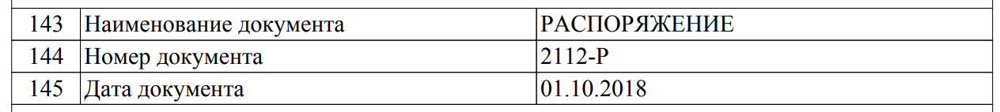

# Оценки численности

На сегодняшний день нет четкой методики определения точной численности некоммерческих организации, которые можно отнести к государственным НКО.

Примерная оценка численности государственных НКО - не менее **500** и не более **12 000** организаций.

В зависимости от классификации организаций можно выделить три способа их учёта.

## Учёт на основе отметок в Едином государственном реестре юридических лиц

**48 НКО** на федеральном уровне и **454 НКО** в подчинении властей субъектов федерации имеют соответствующие пометки в ЕГРЮЛ. Это те организации учредителями которых являются органы власти и уровень власти указан в специальном коде признаке, имеющем одно из трёх значений:

- 1 - Российская Федерация
- 2 - Субъекты федерации
- 3 - Местное самоуправление

При этом данный код не является всеобъемлющим и не покрывает все организации, созданные органами власти. Например, Агентство стратегических инициатив имеет единственного учредителя в лице Правительства Российской Федерации, однако не имеет признака с кодом "Российская Федерация". И таких примеров довольно много.

## Учёт на основе сведений об учредителе

Поскольку в ЕГРЮЛ у большинства организаций имеются сведения о их учредителях, то один из основных способов идентификации государственных НКО — это анализ цепочки учредителей организации.

На основе работ по классификации НКО в проекте Открытые НКО (openngo.ru) к НКО, имеющим государственных учредителей, было отнесено:

- **2947 НКО** в подчинении федеральной власти
- **2756 НКО** в подчинении властей субъектов федерации
- **5684 НКО** в подчинении у местного самоуправления

При этом некоторые организации могут относиться к нескольким группам. Например,

_Микрокредитная компания Тульской области Областной фонд поддержки малого предпринимательства_ учреждена Правительством Тульской области и Федеральным фондом поддержки малого предпринимательства.

В то же время некоторые НКО таким образом невозможно идентифицировать поскольку их учредители могут отсутствовать в ЕГРЮЛ. Пример: Российский научный фонд, является одним из крупнейших получателей бюджетного финансирования, учреждён в соответствии с федеральным законом, но в ЕГРЮЛ не отражена его принадлежность к Российской Федерации как к учредителю.

Кроме того, при подобной оценке в список государственных НКО попадают и многочисленные ассоциации и иные организации, где также участвуют физические лица и коммерческие компании, а значит итоговый список необходимо подвергать последующей дополнительной проверке.

## Учёт на основе сведений о нормативно-правовых учреждающих документах

Многие (но не все) государственные НКО создаются на основе законов, постановлений и поручений, инициированных органами власти и высшими должностными лицами. Например, Российский научный фонд был создан через принятие [федерального закона "О Российском научном фонде и внесении изменений в отдельные законодательные акты Российской Федерации" от 02.11.2013 N 291-ФЗ](https://rg.ru/documents/2013/11/06/nauch-fond-dok.html).

Можно было бы провести анализ нормативно-правовой базы за последние 20 лет и идентифицировать НПА и документы поручений с указанием на создание государственных НКО. Однако ввиду заведомой сложности и трудоёмкости этой работы есть и альтернативный способ. При регистрации организации в первой записи в ЕГРЮЛ содержится обоснование её регистрации и для государственных НКО в обоснованиях, обычно, указывается НПА, как то, Федеральный закон или Постановление.

В ЕГРЮЛ содержится **1539 НКО,** содержащих отсылки к федеральным законам и постановлениям, однако этот список почти не покрывает НКО, созданные государственными организациями. Например, в него не входит АНО "ТВ Новости", дочерняя организация ФГУП "Россия сегодня" и крупнейший получатель субсидий из федерального бюджета и, также, через постановления создаются многие профсоюзные организации и даже религиозные организации.

В то же время многие НКО создаются распоряжениями органов власти, например, Фонд жилищного строительства Ямало-Ненецкого автономного округа создан Департаментом строительства и жилищной политики ЯНАО в соответствии с распоряжением Правительства Ямало-Ненецкого автономного округа от 24 июля 2010 года №50-РП «О создании Некоммерческой организации «Фонд жилищного строительства Ямало-Ненецкого автономного округа»

А при регистрации АНО "Центр изучения и сетевого мониторинга молодёжной среды" (АНО "ЦИСМ) указано что оно создано в соответствии с распоряжением 2112-Р от 1 октября 2018 г. в то же время подобного распоряжения нет в открытом доступе, ни от Правительства РФ, ни от Федерального агентства по делам молодёжи выступающего в качестве учредителя. 
```admonish note
Это распоряжение упоминается в официальной выписке в ЕГРЮЛ, его можно найти на сайте [egrul.nalog.ru](https://egrul.nalog.ru) по номеру ИНН _9709037529_ и найти строки 143-145

```

Судя по дате регистрации организации и распоряжениям за 2010-2019 годы с тем же номером 2112-Р - это распоряжение Правительства Российской Федерации. Оно [отсутствует на сайте Правительства РФ](http://government.ru/docs/all/?type=102000066\_102000499&number=2112-%D0%A0&text=&dt=&dt.till=&dt.since=).

В то же время, например, агентство стратегических инициатив создано через [распоряжение Правительства РФ от 11 августа 2011 г. N 1393-р "Об учреждении автономной некоммерческой организации "Агентство стратегических инициатив по продвижению новых проектов"](http://www.pravo.gov.ru/proxy/ips/?doc_itself=&nd=102149871) которое доступно и которое каждый может открыть и прочитать.

--

Разработка методики более точной оценки должна иметь в своей основе цели такой количественной оценки и наиболее вероятной целью может быть учёт подобных организаций в целях регулирования их отчетности, открытости, хозяйственной деятельности и иных требований.

